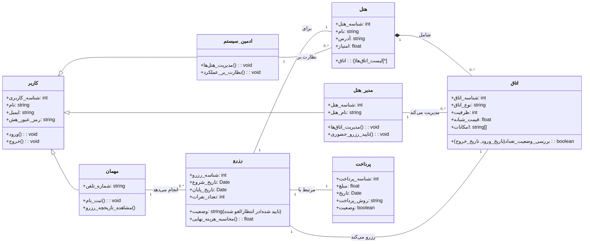

```mermaid
classDiagram
    direction LR

    class کاربر {
        +شناسه_کاربری: int
        +نام: string
        +ایمیل: string
        +رمز_عبور_هش: string
        +ورود(): void
        +خروج(): void
    }

    class مهمان {
        +شماره_تلفن: string
        +ثبت_نام(): void
        +مشاهده_تاریخچه_رزرو()
    }

    class مدیر_هتل {
        +شناسه_هتل: int
        +نام_هتل: string
        +مدیریت_اتاق‌ها(): void
        +تایید_رزرو_حضوری(): void
    }

    class ادمین_سیستم {
        +مدیریت_هتل‌ها(): void
        +نظارت_بر_عملکرد(): void
    }

    class هتل {
        +شناسه_هتل: int
        +نام: string
        +آدرس: string
        +امتیاز: float
        +لیست_اتاق‌ها(): اتاق[*]
    }

    class اتاق {
        +شناسه_اتاق: int
        +نوع_اتاق: string
        +ظرفیت: int
        +قیمت_شبانه: float
        +امکانات: string[]
        +بررسی_وضعیت_تعداد(تاریخ_ورود, تاریخ_خروج): boolean
    }

    class رزرو {
        +شناسه_رزرو: int
        +تاریخ_شروع: Date
        +تاریخ_پایان: Date
        +تعداد_نفرات: int
        +وضعیت: string (تایید شده/در انتظار/لغو شده)
        +محاسبه_هزینه_نهایی(): float
    }

    class پرداخت {
        +شناسه_پرداخت: int
        +مبلغ: float
        +تاریخ: Date
        +روش_پرداخت: string
        +وضعیت: boolean
    }

    %% روابط ارث‌بری (Inheritance)
    کاربر <|-- مهمان
    کاربر <|-- مدیر_هتل
    کاربر <|-- ادمین_سیستم

    %% روابط اسمبلی (Aggregation/Composition)
    هتل "1" *-- "0..*" اتاق : شامل
    مهمان "1" -- "0..*" رزرو : انجام می‌دهد
    مدیر_هتل "1" -- "0..*" اتاق : مدیریت می‌کند
    رزرو "1" -- "1" پرداخت : مرتبط با
    رزرو "1" -- "1" هتل : برای
    رزرو "1" -- "1" اتاق : رزرو می‌کند
    ادمین_سیستم "1" -- "0..*" هتل : نظارت بر
```
